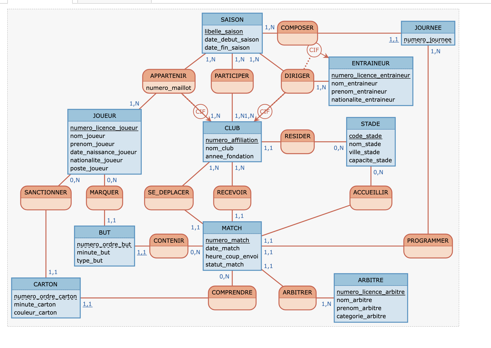

# Mini-projet Bases de données : championnat de football professionnel

**Module :** TI503N – Bases de données 1 : Concepts de base (EFREI)
**Binôme :** Dilipkumar Niroshan et Vigarnan Harisram
**Partie 1 :** analyse des besoins et MCD (rendu du 16/10/2026)

---

## 1. Présentation du projet

Ce projet applique la méthode MERISE à la conception d'une base de données pour une organisation qui gère un championnat national de football professionnel. L'organisation s'inspire de la Ligue de Football Professionnel (LFP), association loi 1901 qui gère la Ligue 1 en France, ainsi que de la Premier League (Angleterre) et de LaLiga (Espagne).

La base couvre l'aspect sportif du championnat : les saisons et leurs journées, les clubs et leurs stades, les joueurs et la composition des effectifs à chaque saison, les entraîneurs, les arbitres, les matchs, les buts et les cartons. Les transferts, les salaires, la billetterie, les droits TV et les sanctions administratives sont hors périmètre.

La partie 1 correspond aux étapes 1 (analyse des besoins) et 2 (MCD) du projet.

## 2. Organisation du dépôt

```
.
├── README.md                      Documentation du projet
├── prompts/
│   └── prompt_iteration_3.txt     Prompt final soumis à l'IA
├── reponses_ia/
│   └── reponse_iteration_3.md     Réponse brute de l'IA au prompt final
└── mcd/
    ├── mcd_ligue_football.mcd     Fichier source du MCD (Mocodo)
    └── mcd_ligue_football.png     Image du MCD exportée depuis Mocodo
```

---

## 3. Étape 1 : analyse des besoins

### 3.1 Démarche

Nous sommes partis de la base de prompt fournie, construite selon le framework RICARDO. Nous avons complété les parties « Contexte » (domaine, activité, organisations de référence, données collectées) et « Références » (sites de la LFP, de la Ligue 1, de la FFF, de l'IFAB et de Transfermarkt), sans modifier la structure imposée. Quelques phrases ont été ajoutées au fil des itérations pour préciser le périmètre et les attentes.

**IA utilisée :** Claude (Anthropic)

Le prompt a été soumis trois fois, en entier à chaque fois. La première itération a été générée dans la conversation qui avait servi à préparer le prompt, ce qui a influencé la réponse. Les itérations 2 et 3 ont donc été soumises dans des conversations neuves, afin que le résultat dépende uniquement du prompt.

### 3.2 Historique des itérations

#### Itération 1

**Prompt :** base complétée (contexte, références, périmètre excluant les transferts, les salaires, la billetterie et les droits TV).

**Problèmes relevés dans la réponse :**
- contradiction avec le périmètre : la réponse autorisait les changements de club en cours de saison (mercato d'hiver) et ajoutait une date d'intégration dans l'effectif, alors que les transferts étaient exclus ;
- un nombre de clubs (18) et de journées (34) imposé, alors que l'organisation s'inspire de plusieurs championnats ;
- un entraîneur suivi avec une date de prise de fonction mais sans date de fin ;
- des règles trop détaillées (joueur exclu, deuxième carton jaune transformé en rouge), qui auraient créé des contraintes inutiles ;
- un choix de conception dans les règles (« le score n'est pas noté séparément »), contraire à la consigne « sans a priori sur la modélisation ».

#### Itération 2

**Modifications du prompt :**
- ajout dans le premier paragraphe : « Pour simplifier, on considère qu'au cours d'une saison, un joueur appartient à un seul club et un club a un seul entraîneur principal ; le nombre de clubs participants est fixé pour chaque saison. » ;
- ajout dans le troisième paragraphe : « Limite-toi aux règles essentielles à la gestion du championnat, sans détailler les règles du jeu, et sans préciser si une information doit être enregistrée ou calculée. »

**Problèmes relevés dans la réponse :**
- trois données calculables dans le dictionnaire : le nombre de buts du club qui reçoit, le nombre de buts du club visiteur et le nombre de points au classement ;
- des règles et une donnée sur les retraits de points (DNCG), qui relèvent de la discipline administrative et non de l'aspect sportif ;
- une règle sur la promotion et la relégation, sans utilité pour la modélisation.

Les problèmes de l'itération 1 étaient en revanche corrigés.

#### Itération 3

**Modifications du prompt :**
- extension du périmètre exclu dans le premier paragraphe : « les transferts, les salaires, la billetterie, les droits TV et les sanctions administratives (retraits de points, suspensions) ne sont pas concernés » ;
- ajout dans le quatrième paragraphe : « Il ne doit contenir que des données élémentaires, et pas de données calculables à partir d'autres données. »

**Résultat :** les scores, les points et les retraits de points ont disparu. Le dictionnaire compte 34 données. Ce résultat a été conservé (voir l'analyse en section 3.6).

### 3.3 Prompt final (itération 3)

```text
Tu travailles dans le domaine du football professionnel. Ton organisation a comme activité d'organiser et de gérer un championnat national de football professionnel, dans lequel des clubs s'affrontent en matchs aller et retour au cours d'une saison. C'est une organisation comme la Ligue de Football Professionnel (LFP), qui gère la Ligue 1 en France, la Premier League en Angleterre ou LaLiga en Espagne. Les données ont été collectées sur les saisons et leurs journées, les clubs et leurs stades, les joueurs et la composition des effectifs à chaque saison, les entraîneurs, les arbitres, les matchs, ainsi que les buts et les cartons. Le périmètre se limite à l'aspect sportif du championnat : les transferts, les salaires, la billetterie, les droits TV et les sanctions administratives (retraits de points, suspensions) ne sont pas concernés. Pour simplifier, on considère qu'au cours d'une saison, un joueur appartient à un seul club et un club a un seul entraîneur principal ; le nombre de clubs participants est fixé pour chaque saison. Inspire-toi des sites web suivants : https://www.lfp.fr (site officiel de la LFP), https://ligue1.com (site officiel de la Ligue 1), https://www.fff.fr (règlements de la Fédération Française de Football), https://www.theifab.com (lois du jeu) et https://www.transfermarkt.fr (effectifs et fiches des joueurs).

Ton organisation veut appliquer MERISE pour concevoir un système d'information. Tu es chargé de la partie analyse, c'est-à-dire de collecter les besoins auprès de l'entreprise. Elle a fait appel à un étudiant en ingénierie informatique pour réaliser ce projet, tu dois lui fournir les informations nécessaires pour qu'il applique ensuite lui-même les étapes suivantes de conception et développement de la base de données.

D'abord, établis les règles de gestions des données de ton organisation, sous la forme d'une liste à puce. Elle doit correspondre aux informations que fournit quelqu'un qui connaît le fonctionnement de l'entreprise, mais pas comment se construit un système d'information. Limite-toi aux règles essentielles à la gestion du championnat, sans détailler les règles du jeu, et sans préciser si une information doit être enregistrée ou calculée.

Ensuite, à partir de ces règles, fournis un dictionnaire de données brutes avec les colonnes suivantes, regroupées dans un tableau : signification de la donnée, type, taille en nombre de caractères ou de chiffres. Il doit y avoir entre 25 et 35 données. Il ne doit contenir que des données élémentaires, et pas de données calculables à partir d'autres données. Il sert à fournir des informations supplémentaires sur chaque donnée (taille et type) mais sans a priori sur comment les données vont être modélisées ensuite.

Fournis donc les règles de gestion et le dictionnaire de données.
```

### 3.4 Règles de gestion obtenues

Réponse de l'IA reproduite sans modification (également disponible dans `reponses_ia/reponse_iteration_3.md`).

**Saisons et journées**
- Le championnat se dispute par saisons. Chaque saison est désignée par les deux années qu'elle couvre (par exemple « 2025-2026 »). Elle a une date de début et une date de fin.
- Le nombre de clubs participants est fixé pour chaque saison (par exemple 18 clubs en Ligue 1 depuis 2023-2024, 20 auparavant).
- Une saison est découpée en journées numérotées à partir de 1. Elle compte 2 × (nombre de clubs − 1) journées. La première moitié forme la phase aller, la seconde la phase retour.
- Une journée appartient à une seule saison.

**Clubs et stades**
- Chaque club est identifié par son numéro d'affiliation à la Fédération. Il a un nom et une année de fondation.
- Un club peut participer à plusieurs saisons, consécutives ou non, au gré des montées et des descentes.
- Chaque stade est identifié par un code. Il a un nom, une ville et une capacité (nombre de places).
- Chaque club a un stade de résidence où il joue habituellement ses matchs à domicile. Un même stade peut être le stade de résidence de plusieurs clubs.

**Joueurs et effectifs**
- Chaque joueur est identifié par son numéro de licence. Il a un nom, un prénom, une date de naissance, une nationalité sportive et un poste (gardien, défenseur, milieu ou attaquant).
- Chaque saison, chaque club participant dispose d'un effectif composé de plusieurs joueurs.
- Au cours d'une saison, un joueur appartient à l'effectif d'un seul club. D'une saison à l'autre, il peut changer de club ou ne faire partie d'aucun effectif du championnat.
- Pour une saison, chaque joueur de l'effectif porte un numéro de maillot compris entre 1 et 99. Deux joueurs d'un même club ne peuvent pas porter le même numéro au cours de la même saison.

**Entraîneurs**
- Chaque entraîneur est identifié par son numéro de licence. Il a un nom, un prénom et une nationalité.
- Chaque saison, chaque club participant a un seul entraîneur principal.
- Au cours d'une saison, un entraîneur dirige au plus un club. Il peut entraîner des clubs différents d'une saison à l'autre.

**Arbitres**
- Chaque arbitre est identifié par son numéro de licence. Il a un nom, un prénom et une catégorie (par exemple « Fédéral 1 » ou « International »).
- Chaque match est dirigé par un seul arbitre principal. Un arbitre dirige plusieurs matchs au cours d'une saison.

**Matchs**
- Chaque match est identifié par un numéro et appartient à une journée d'une saison.
- Un match oppose deux clubs différents qui participent à la saison : un club qui reçoit et un club qui se déplace.
- Au cours d'une saison, deux clubs se rencontrent exactement deux fois, une fois chez chacun d'eux (match aller et match retour).
- Lors d'une journée, chaque club participant dispute un seul match.
- Chaque match a une date et une heure de coup d'envoi. Un match reporté reste rattaché à sa journée d'origine, même s'il se joue à une autre date.
- Un match se joue dans un stade. C'est en principe celui du club qui reçoit, mais le match peut être délocalisé dans un autre stade (travaux, pelouse impraticable…).

**Buts**
- Au cours d'un match, un but est marqué par un joueur à une minute de jeu précise. Un joueur peut marquer plusieurs buts dans un même match.
- Un but est marqué dans le jeu, sur penalty ou contre son camp. Un but contre son camp profite au club adverse de celui du joueur qui l'a marqué.
- Le joueur qui marque appartient, pour la saison concernée, à l'effectif de l'un des deux clubs qui disputent le match.
- Le score d'un match correspond au nombre de buts obtenus par chacun des deux clubs.

**Cartons**
- Au cours d'un match, l'arbitre peut donner un ou plusieurs cartons, jaunes ou rouges, à un même joueur. Chaque carton est donné à une minute de jeu précise.
- Le joueur sanctionné appartient, pour la saison concernée, à l'effectif de l'un des deux clubs du match.
- Seuls les cartons reçus par les joueurs sont concernés, pas ceux adressés aux entraîneurs ou au staff. Les suspensions qui peuvent en découler relèvent de la commission de discipline et sont hors du périmètre.

**Classement**
- Chaque match rapporte 3 points au vainqueur et 0 au perdant. En cas de match nul, chaque club obtient 1 point.
- Le classement d'une saison est établi à l'issue de chaque journée. Il range les clubs selon leur total de points et repose uniquement sur les résultats sportifs. En cas d'égalité de points, les clubs sont départagés d'abord par la différence de buts générale, puis par les critères complémentaires du règlement (confrontations directes, buts marqués…).

### 3.5 Dictionnaire de données obtenu

| Signification de la donnée | Type | Taille |
|---|---|---|
| Libellé de la saison (ex. 2025-2026) | Alphanumérique | 9 |
| Date de début de la saison | Date | 10 |
| Date de fin de la saison | Date | 10 |
| Nombre de clubs participants à la saison | Numérique | 2 |
| Numéro de la journée | Numérique | 2 |
| Numéro d'affiliation du club | Numérique | 6 |
| Nom du club | Alphanumérique | 50 |
| Année de fondation du club | Numérique | 4 |
| Code du stade | Alphanumérique | 6 |
| Nom du stade | Alphanumérique | 50 |
| Ville du stade | Alphabétique | 50 |
| Capacité du stade (nombre de places) | Numérique | 6 |
| Numéro de licence du joueur | Numérique | 10 |
| Nom du joueur | Alphabétique | 50 |
| Prénom du joueur | Alphabétique | 50 |
| Date de naissance du joueur | Date | 10 |
| Nationalité sportive du joueur | Alphabétique | 30 |
| Poste du joueur (gardien, défenseur, milieu, attaquant) | Alphabétique | 10 |
| Numéro de maillot du joueur | Numérique | 2 |
| Numéro de licence de l'entraîneur | Numérique | 10 |
| Nom de l'entraîneur | Alphabétique | 50 |
| Prénom de l'entraîneur | Alphabétique | 50 |
| Nationalité de l'entraîneur | Alphabétique | 30 |
| Numéro de licence de l'arbitre | Numérique | 10 |
| Nom de l'arbitre | Alphabétique | 50 |
| Prénom de l'arbitre | Alphabétique | 50 |
| Catégorie de l'arbitre (ex. Fédéral 1, International) | Alphanumérique | 20 |
| Numéro du match | Numérique | 6 |
| Date du match | Date | 10 |
| Heure du coup d'envoi | Heure | 5 |
| Minute de jeu du but | Numérique | 3 |
| Type de but (jeu, penalty, contre son camp) | Alphabétique | 15 |
| Couleur du carton (jaune, rouge) | Alphabétique | 5 |
| Minute de jeu du carton | Numérique | 3 |

Le dictionnaire contient 34 données. Les dates sont au format JJ/MM/AAAA (10 caractères) et les heures au format HH:MM (5 caractères).

### 3.6 Analyse du résultat et modifications retenues pour le MCD

**Résultat retenu.** La troisième itération du prompt a été conservée comme résultat final de l'analyse des besoins. Elle respecte le format demandé (règles en liste à puces, dictionnaire en tableau à trois colonnes), le nombre de données (34, dans la fourchette de 25 à 35) et le périmètre fixé. Nous avons choisi de ne pas lancer de quatrième itération, car chaque nouvelle génération risquait de dégrader des points déjà corrects. Les écarts restants sont traités ci-dessous.

**Constat sur les identifiants.** L'IA a introduit des identifiants alors que la consigne demandait de ne pas anticiper la modélisation. Nous les avons conservés, car la plupart sont de vraies données métier : les numéros de licence (joueurs, entraîneurs, arbitres) et les numéros d'affiliation (clubs) sont réellement attribués par la Fédération. Ils servent d'identifiants dans le MCD.

**Modifications retenues pour la modélisation :**
- le nombre de clubs participants a été retiré du dictionnaire après trois itérations, comme le sujet l'autorise, car il peut être obtenu en comptant les clubs participant à une saison. La règle métier « le nombre de clubs est fixé pour chaque saison » reste valable ;
- un statut du match est ajouté dans le MCD, afin de distinguer un match programmé, joué ou reporté. Sans lui, un match sans but enregistré ne se distingue pas d'un match non encore joué, ce qui fausserait le calcul du classement ;
- un numéro d'ordre est ajouté aux buts et aux cartons, afin de distinguer plusieurs événements du même type au cours d'un même match. La minute ne suffit pas : deux cartons peuvent être donnés à la même minute.

Le sujet autorise l'ajout de données dans le MCD. Celui-ci intègre donc les 33 données restantes du dictionnaire et 3 données ajoutées, soit 36 attributs.

**Limites identifiées dans la réponse de l'IA :**
- la formule 2 × (nombre de clubs − 1) suppose implicitement que le championnat comporte un nombre pair de clubs ;
- les critères de départage du classement sont trop précis et mélangent potentiellement les règlements de plusieurs championnats (LaLiga, par exemple, départage d'abord par les confrontations directes) ;
- le code du stade a été proposé par l'IA sans référence métier précise permettant d'en justifier le format.

---

## 4. Étape 2 : MCD

### 4.1 Schéma

Le MCD a été réalisé avec **Mocodo** (mocodo.net). Le fichier source est `mcd/mcd_ligue_football.mcd`.



Notation Mocodo : les identifiants sont soulignés. Pour les entités faibles, l'identifiant relatif est souligné en pointillés et la cardinalité 1,1 du lien d'identification est marquée d'un trait. Les cercles « CIF » représentent les contraintes d'intégrité fonctionnelle.

### 4.2 Entités

Les données marquées d'un astérisque (*) ont été ajoutées au dictionnaire (voir section 3.6).

| Entité | Identifiant | Autres attributs | Remarque |
|---|---|---|---|
| SAISON | libelle_saison | date_debut_saison, date_fin_saison | |
| JOURNEE | numero_journee (relatif à SAISON) | | Entité faible |
| CLUB | numero_affiliation | nom_club, annee_fondation | |
| STADE | code_stade | nom_stade, ville_stade, capacite_stade | |
| JOUEUR | numero_licence_joueur | nom_joueur, prenom_joueur, date_naissance_joueur, nationalite_joueur, poste_joueur | Le poste est rattaché au joueur, comme dans les règles |
| ENTRAINEUR | numero_licence_entraineur | nom_entraineur, prenom_entraineur, nationalite_entraineur | |
| ARBITRE | numero_licence_arbitre | nom_arbitre, prenom_arbitre, categorie_arbitre | |
| MATCH | numero_match | date_match, heure_coup_envoi, statut_match* | |
| BUT | numero_ordre_but* (relatif à MATCH) | minute_but, type_but | Entité faible |
| CARTON | numero_ordre_carton* (relatif à MATCH) | minute_carton, couleur_carton | Entité faible |

L'attribut numero_maillot n'appartient à aucune entité : il est porté par l'association ternaire APPARTENIR (voir section 4.4).

### 4.3 Associations et cardinalités

| Association | Entités et cardinalités | Règle de gestion correspondante |
|---|---|---|
| COMPOSER | SAISON 1,N — JOURNEE 1,1 (identification relative) | Une journée appartient à une seule saison. |
| PARTICIPER | CLUB 1,N — SAISON 1,N | Un club participe à une ou plusieurs saisons, une saison réunit plusieurs clubs. |
| APPARTENIR (numero_maillot) | JOUEUR 1,N — CLUB 1,N — SAISON 1,N | Chaque saison, chaque club dispose d'un effectif. |
| DIRIGER | ENTRAINEUR 1,N — CLUB 1,N — SAISON 1,N | Chaque saison, chaque club a un seul entraîneur principal. |
| RESIDER | CLUB 1,1 — STADE 0,N | Chaque club a un stade de résidence, qui peut être partagé. |
| PROGRAMMER | MATCH 1,1 — JOURNEE 1,N | Un match appartient à une journée, même s'il est reporté. |
| RECEVOIR | MATCH 1,1 — CLUB 1,N | Le club qui reçoit. |
| SE_DEPLACER | MATCH 1,1 — CLUB 1,N | Le club qui se déplace. |
| ACCUEILLIR | MATCH 1,1 — STADE 0,N | Le stade où se joue le match, qui peut différer du stade de résidence. |
| ARBITRER | MATCH 1,1 — ARBITRE 1,N | Chaque match est dirigé par un seul arbitre principal. |
| CONTENIR | MATCH 0,N — BUT 1,1 (identification relative) | Un match peut se terminer sans but. |
| MARQUER | BUT 1,1 — JOUEUR 0,N | Un but est marqué par un joueur. Un joueur peut ne jamais marquer. |
| COMPRENDRE | MATCH 0,N — CARTON 1,1 (identification relative) | Un match peut se dérouler sans carton. |
| SANCTIONNER | CARTON 1,1 — JOUEUR 0,N | Un carton est donné à un joueur. |

**Hypothèse sur les cardinalités minimales.** La base ne contient que des acteurs du championnat : tout club, joueur, entraîneur ou arbitre enregistré a participé à au moins une saison. C'est ce qui justifie les cardinalités minimales à 1 pour ces entités.

**Choix notables.** Un match est relié deux fois à CLUB, par deux associations distinctes (RECEVOIR et SE_DEPLACER), car les deux clubs jouent des rôles différents. De même, le stade de résidence d'un club (RESIDER) est séparé du stade où se joue réellement un match (ACCUEILLIR), puisqu'un match peut être délocalisé.

### 4.4 Éléments de modélisation avancée

**Entités faibles.** Le numéro 12 n'identifie pas une journée à lui seul, puisque chaque saison possède une journée 12. L'identifiant complet de JOURNEE est donc la saison et le numéro de journée. De la même façon, le « premier but » ou le « deuxième carton » n'a de sens qu'au sein d'un match donné : BUT et CARTON sont des entités faibles de MATCH.

**Associations ternaires.** Le numéro de maillot et le club d'un joueur ne peuvent pas être déterminés par le joueur seul : ils dépendent de la saison. Pour un couple joueur-saison, il existe au plus un club. Nous avons donc conservé une association ternaire JOUEUR–CLUB–SAISON (APPARTENIR), porteuse du numéro de maillot, avec une CIF joueur + saison → club. On ne peut pas la remplacer par des associations binaires indépendantes sans perdre l'information selon laquelle le club dépend du couple joueur + saison. Une entité associative EFFECTIF aurait été une alternative possible, mais la ternaire traduit plus directement la règle de gestion.

L'association DIRIGER (ENTRAINEUR–CLUB–SAISON) suit la même logique pour les entraîneurs principaux, avec deux CIF.

### 4.5 Contraintes non représentées par les cardinalités

Les contraintes suivantes découlent des règles de gestion mais ne peuvent pas être exprimées par les seules cardinalités. Les trois premières sont dessinées sur le MCD sous forme de CIF. Toutes seront traitées dans la partie 2 (contraintes SQL ou requêtes de vérification).

1. **CIF sur APPARTENIR :** pour un joueur et une saison, il existe au plus un club.
2. **CIF sur DIRIGER :** pour un club et une saison, il existe un seul entraîneur principal.
3. **CIF sur DIRIGER :** pour un entraîneur et une saison, il existe au plus un club.
4. **Numéro de maillot :** le triplet (club, saison, numéro de maillot) est unique, et le numéro est compris entre 1 et 99.
5. **Cohérence avec PARTICIPER :** un club n'a un effectif, un entraîneur ou des matchs que pour une saison à laquelle il participe, et chaque club participant a un entraîneur principal.
6. **Clubs d'un match :** le club qui reçoit et le club qui se déplace sont différents.
7. **Rencontres :** au cours d'une saison, deux clubs se rencontrent exactement deux fois, une fois chez chacun d'eux.
8. **Journées :** lors d'une journée, chaque club participant dispute un seul match.
9. **Buteurs et joueurs sanctionnés :** ils appartiennent, pour la saison du match, à l'effectif de l'un des deux clubs du match.
10. **Domaines de valeurs :** statut_match (programmé, joué, reporté), type_but (jeu, penalty, contre son camp), couleur_carton (jaune, rouge), poste_joueur (gardien, défenseur, milieu, attaquant).

### 4.6 Normalisation

Chaque attribut d'entité dépend de l'identifiant complet de son entité, et de rien d'autre. Par exemple, minute_but dépend du couple (match, numéro d'ordre) et non du numéro d'ordre seul. Le seul attribut porté par une association, numero_maillot, dépend du couple (joueur, saison), qui détermine aussi le club. Aucune donnée calculable n'est stockée : le score, le classement et le nombre de clubs d'une saison seront obtenus par des requêtes.

Nous n'avons identifié aucune dépendance fonctionnelle problématique au niveau du MCD. La vérification formelle de la troisième forme normale sera faite sur le MLD, où elle s'exprime sur les relations.

### 4.7 Conventions de nommage

Les attributs sont suffixés par le nom de leur entité (nom_joueur, nom_arbitre…) pour éviter toute ambiguïté. Les noms ne comportent pas d'accents, afin de faciliter la génération du code SQL dans la partie 2.

« MATCH » est un mot réservé en MySQL. Si ce SGBD est retenu pour la partie 2, l'entité pourra être renommée RENCONTRE lors du passage au MLD.

---

## 5. Partie 2 (à venir)

Les étapes 3 à 6 (MLD et MPD, insertion des données, requêtes, vidéo de présentation) seront documentées ici pour le rendu du 09/11/2026.

---

## Références

- Sujet : mini-projet TI503N, conçu par Lena TREBAUL (EFREI)
- Ligue de Football Professionnel : https://www.lfp.fr
- Site officiel de la Ligue 1 : https://ligue1.com
- Fédération Française de Football : https://www.fff.fr
- IFAB, lois du jeu : https://www.theifab.com
- Transfermarkt : https://www.transfermarkt.fr
- Mocodo : https://www.mocodo.net
